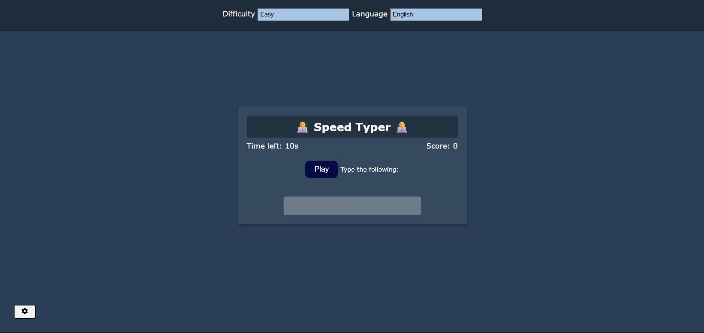
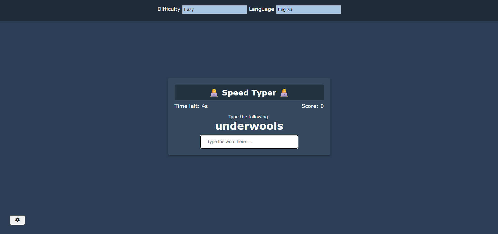
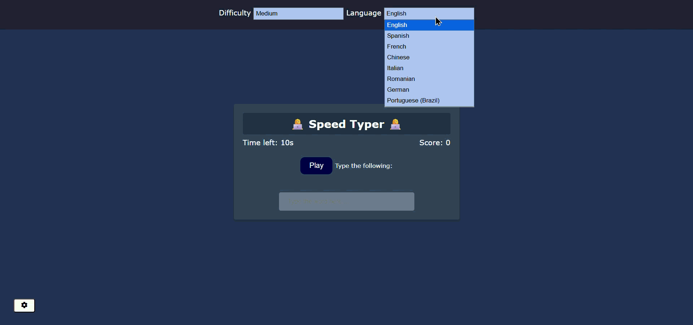

# Speed Typer

## Project Overview

The **Speed Typer** is a browser-based typing speed game where players must correctly type randomly fetched words before a countdown timer expires.

Each correct word earns a point and adds bonus time to the clock. The game ends when the timer hits zero and displays the player's final score. The project demonstrates fundamental front-end development concepts using **HTML**, **CSS**, and **JavaScript**, including DOM manipulation, API requests, event handling, and localStorage persistence.

---

# Technologies Used

* **HTML5** – Defines the structure of the game, settings panel, and end-game modal.
* **CSS3** – Provides styling, layout, and modal overlay behavior.
* **JavaScript (Vanilla JS)** – Handles game logic, API calls, timer, scoring, and settings persistence.
* **Random Word API** – External REST API used to fetch random words in multiple languages.

---

# Project Structure

```
typing-game/
│
├── index.html
├── style.css
├── script.js
├── README.md
│
└── assets/
    ├── screenshot1.png
    ├── screenshot2.png
    └── demo.gif
```

---

# HTML Structure (index.html)

The HTML file defines the layout of the Speed Typer game.

## Main Components

| Element             | Purpose                                              |
| ------------------- | ---------------------------------------------------- |
| `#settings-btn`     | Gear icon button that toggles the settings panel     |
| `#settings`         | Top bar containing difficulty and language selects   |
| `.container`        | Main game card holding all game elements             |
| `#play-btn`         | Button to start the game                             |
| `#word`             | Displays the current word the player must type       |
| `#text`             | Input field where the player types                   |
| `#time`             | Countdown timer display                              |
| `#score`            | Current score display                                |
| `#end-game-modal`   | Overlay shown when the game ends with final score    |
| `#restart-btn`      | Button inside the modal to start a new game          |

---

# CSS Styling (style.css)

The CSS file controls the visual appearance and layout of the game.

## Layout

The body uses **flexbox** to centre the game card on screen.

```css
body {
  display: flex;
  align-items: center;
  justify-content: center;
  min-height: 100vh;
}
```

---

## End-Game Modal

The modal is positioned absolutely inside the container so it covers the card exactly when the game ends.

```css
.end-game-modal {
  display: none;
  position: absolute;
  top: 0;
  left: 0;
  width: 100%;
  height: 100%;
  flex-direction: column;
  align-items: center;
  justify-content: center;
}
```

It is set to `display: none` by default and switched to `display: flex` by JavaScript to activate the centred column layout.

---

## Settings Panel

The settings bar slides in and out using a CSS transform transition.

```css
.settings {
  transform: translateY(0);
  transition: transform 0.3s;
}

.settings.hide {
  transform: translateY(-100%);
}
```

---

## Screenshots





## Demo



---

# JavaScript Functionality (script.js)

The JavaScript file handles all game logic and interactivity.

---

## Selecting DOM Elements

```javascript
const word = document.getElementById('word');
const text = document.getElementById('text');
const scoreEl = document.getElementById('score');
const timeEl = document.getElementById('time');
```

---

## Starting the Game

```javascript
function startGame() {
  playBtn.style.display = 'none';
  score = 0;
  time = 10;
  text.disabled = false;
  text.focus();
  addWordToDOM();
  timeInterval = setInterval(updateTime, 1000);
}
```

When Play is clicked:

1. The play button is hidden
2. Score and timer are reset
3. The input is enabled and focused
4. The first word is fetched from the API
5. The countdown interval starts

---

## Fetching Words from the API

```javascript
async function addWordToDOM() {
  const res = await fetch(`https://random-word-api.herokuapp.com/word?lang=${languageSelect.value}`);
  const data = await res.json();
  randomWord = data[0].normalize('NFD').replace(/[\u0300-\u036f]/g, '');
  word.innerHTML = randomWord;
}
```

Words are normalised immediately after fetching — `NFD` decomposition separates base letters from accent marks, and the regex strips the accents so players only need to type plain characters.

---

## Typing Input Handler

```javascript
text.addEventListener('input', e => {
  if (e.target.value === randomWord) {
    addWordToDOM();
    updateScore();
    e.target.value = '';
    // add bonus time based on difficulty
  }
});
```

On a correct match the input clears, a new word is fetched, and bonus time is added.

---

## Difficulty & Bonus Time

| Difficulty | Bonus Seconds |
| ---------- | ------------- |
| Easy       | +5 seconds    |
| Medium     | +3 seconds    |
| Hard       | +2 seconds    |

---

## Game Over

```javascript
function gameOver() {
  clearInterval(timeInterval);
  text.disabled = true;
  document.getElementById('final-score').textContent = score;
  endgameEl.style.display = 'flex';
}
```

When the timer reaches zero the input is disabled and the modal appears showing the final score.

---

# Settings

The gear icon (bottom-left) toggles a settings bar. Changes take effect immediately and are saved to `localStorage` so preferences survive page refreshes.

```javascript
settingsForm.addEventListener('change', () => {
  localStorage.setItem('difficulty', difficultySelect.value);
  localStorage.setItem('language', languageSelect.value);
});
```

---

# Supported Languages

| Code    | Language              |
| ------- | --------------------- |
| `en`    | English               |
| `es`    | Spanish               |
| `fr`    | French                |
| `zh`    | Chinese               |
| `it`    | Italian               |
| `ro`    | Romanian              |
| `de`    | German                |
| `pt-br` | Portuguese (Brazil)   |

---

# Features

* Click Play to start a timed typing challenge
* Words fetched live from an external API
* Multi-language word support
* Three difficulty levels with different time bonuses
* Real-time score and countdown timer
* Game Over modal displaying the final score
* Restart without losing difficulty and language settings
* Settings persisted across sessions via localStorage

---

# How to Run

No installation or build step is required. Open `index.html` directly in any modern browser:

```
open index.html
```

A live internet connection is required to fetch words from the API.

---

# Learning Outcomes

This project demonstrates the following concepts:

* Async/await and Fetch API
* DOM manipulation and event listeners
* setInterval for countdowns
* Unicode normalisation
* CSS flexbox layout and transform transitions
* localStorage for settings persistence

---

# Author

Created as part of the **Responsive Web Design / Front-End JavaScript projects**.